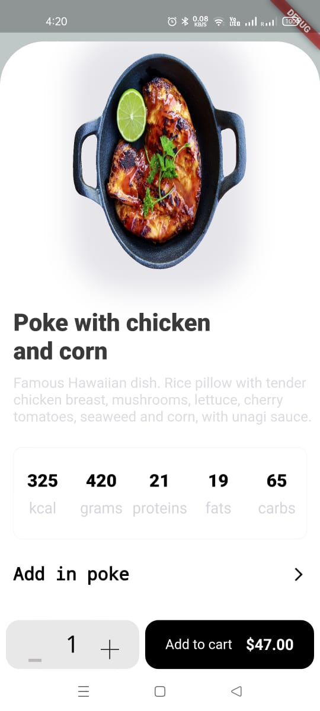
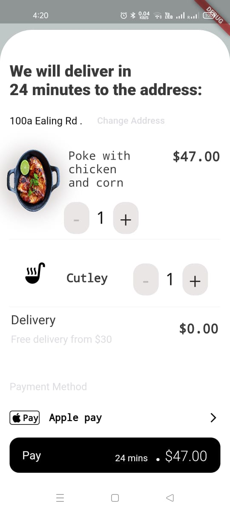

# my_app

# About
`my_app` is an application for online food ordering which is built in Flutter. It is a collection of Food Category, Food Item Details implemented with Flutter.
It also have a customized components of flutter, implementation of thrid party library by using pub_dev library and add animations to this app.
`my_app` i.e. Food Ordering App makes our life easily to order online food at any time from your own place. 

# Features

The android app lets you:

* Collection of Food Items in the Dashboard.

* Implementation of thrid-party Library by using pub_dev library through Flutter.

* Internet-free app.

* Completely ad-free.

* View customize components using flutter.

* Easy to select any Food Item and order it.

* Food will order from Item Cart in app. 

* Visualize bottom sheet animations

# Screenshots

## Dashboard Screen

## Food Item Details

## Food Item Cart

## Download App for better experience

# No Permission Required

## Credits

* Thanks [Flutter Documentation](https://flutter.dev/docs) for components

* Thanks [pub_dev](https://pub.dev/packages) for awesome library.
